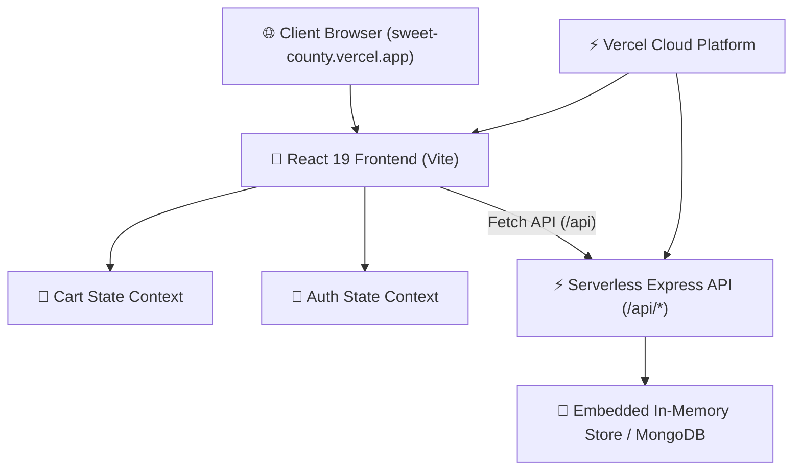

# 🍰 Sweet County Bakery — Artisanal Full-Stack Web App

[](https://sweet-county.vercel.app)
[](https://react.dev/)
[](https://nodejs.org/)
[](https://vercel.com/)

An artisanal full-stack e-commerce web application featuring **3D Levitating Product Spotlights**, an **Interactive 3D Bakery Box Packing Animation**, a **Reassuring Checkout & Payment System (Razorpay / COD)**, and a **Live Admin Dashboard with Customer Database Management**.

👉 **Live Demo**: [https://sweet-county.vercel.app](https://sweet-county.vercel.app)

---

## 🌟 Key Features

### 🍰 1. 3D Levitating Cake Spotlight Modal
* Real-time 3D mouse-tilt container with smooth mid-air floating animation (`@keyframes floatingCakeAir`).
* Floating orbital sparkles (`✨ 🍓 🍫 🌟`) floating around the bakery stage.

### 📦 2. 3D Bakery Box Packing Animation
* Interactive packing sequence before payment:
  * **Step 1**: Selected cake drops into a 3D Sweet County Bakery Box.
  * **Step 2**: Folding branded lid closes down tightly.
  * **Step 3**: Satin golden ribbon wraps and ties into a bow.
  * **Step 4**: Crimson wax seal stamp (`SEALED FRESH • SWEET COUNTY`) applies to guarantee freshness.

### 💳 3. Reassuring Checkout & Payment System
* **Razorpay Online Test Modal**: UPI QR Code (GPay, PhonePe, Paytm, BHIM), Credit/Debit Cards, Netbanking.
* **Cash on Delivery (COD)**: One-click COD order booking with live order ID and 45-minute fresh delivery estimate.

### 🛠️ 4. Admin Dashboard & Customer Database
* Live order tracking pipeline: `Pending` ➔ `Confirmed` ➔ `Out for Delivery` ➔ `Delivered` ➔ `Cancelled`.
* **User Database View**: Displays all registered customer accounts, names, emails, and account roles in real-time.

---

## 🏗️ Technical Architecture



---

## 🚧 Challenges Faced & Technical Solutions

| # | Challenge | Cause | Technical Solution |
|---|-----------|-------|--------------------|
| **1** | **Unstyled Layouts & Motion Loss** | CSS keyframes lost during file overwrites. | Restored full design system & keyframes (`@keyframes floatingCakeAir`) in `index.css`. |
| **2** | **"Could not connect to server"** | Frontend called `localhost:5000` or sleeping Render free tiers. | Unified Frontend & Backend into **Vercel Serverless Functions** (`api/index.js`). |
| **3** | **500 Serverless Execution Error** | `package.json` had `"type": "module"`, conflicting with CommonJS exports. | Converted `api/index.js` to native ES Module export (`export default function handler`). |
| **4** | **404 Error on Direct Load (`/cart`)** | Vercel looked for static file `cart.html` on direct refreshes. | Configured SPA catch-all fallback rewrite in `vercel.json` (`"source": "/(.*)", "destination": "/index.html"`). |

---

## 🚀 Local Development Setup

### Prerequisites
* Node.js (v18+)
* npm or yarn

### 1. Clone & Install
```bash
git clone https://github.com/Soham-ss/Sweet_-County-.git
cd Sweet_-County-

# Install Frontend
cd frontend/react-app
npm install

# Install Backend
cd ../../backend
npm install
```

### 2. Run Locally
```bash
# Start Backend (Port 5000)
cd backend
npm run dev

# Start Frontend (Port 5173)
cd frontend/react-app
npm run dev
```

---

## 📄 Project Presentation Deck

A complete slide-deck presentation document is available in `docs/PROJECT_PRESENTATION.md` and `docs/PROJECT_PRESENTATION.html`.

---

## 📜 License
Developed with ❤️ by Soham Shinde for Sweet County Bakery.
